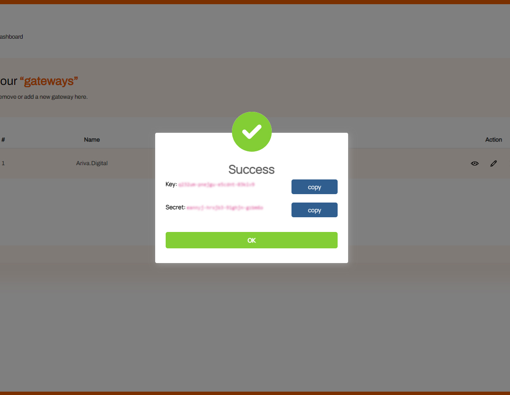

<h1>Ariva.Finance</h1>

Ariva.Finance is a secure, fast, and easy way to accept cryptocurrencies in your business. Create a new payment gateway in a minute, integrate it with your website or application, and start accepting cryptocurrencies.

It meets the global need for a quicker and more transparent payment system with low transaction fees. Online transactions such as travel booking and shopping have increased as the use of the internet increases, and e-commerce has become a significant part of the global market segment. Online buyers and sellers incur so much cost paying traditional banking systems commissions and hidden fees. Ariva.Finance is a new-generation payment gateway that offers solutions using blockchain technology.

<h2>Getting API Credentials</h2>

1. To start using Ariva.Finance gateway, you have to register a new account, by visiting the <a href="https://www.ariva.finance/signup">https://www.ariva.finance/signup</a> page.

2. Then verify your email by, clicking on the link sent to your email address.

3. Go to the “Gateways” section.

4. Create a new Gateway

5. Your API credentials will appear on the pop-up, use this information for your e-commerce site. Please keep your “Secret” in a safe place, after closing this popup, it will disappear.

Browse sample codes or plugins to integrate a payment gateway into your website or application.

